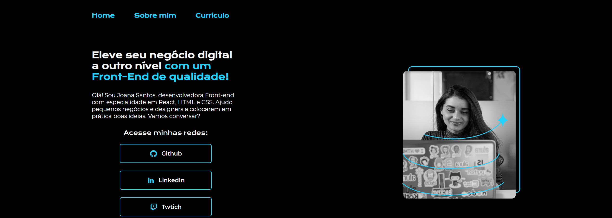

# 🖥️ Portfolio Template

Projeto web de um template de portfólio pessoa desenvolvido como parte do curso 'HTML e CSS: cabeçalho, footer e variáveis CSS', da Alura. O projeto teve como objetivo a aplicação de conceitos fundamentais deestruturação semântica e estilização com variáveis CSS. O layout das páginas foi baseado em um design disponível no [Figma](https://www.figma.com/design/NrzJacC887svMVfF9oC2jM/Portfolio-Projeto-2?node-id=0-1&p=f).

## 🎨 Captura de Tela

## 🖥️ Visualize o projeto

[url-do-projeto](url-do-projeto)

## ️⚙️ Tecnologias Usadas

- HTML5
- CSS3

#

Feito por [Julian Luhring](https://github.com/luhring-julian).

Este projeto foi criado para fins de aprendizado e portfólio.
